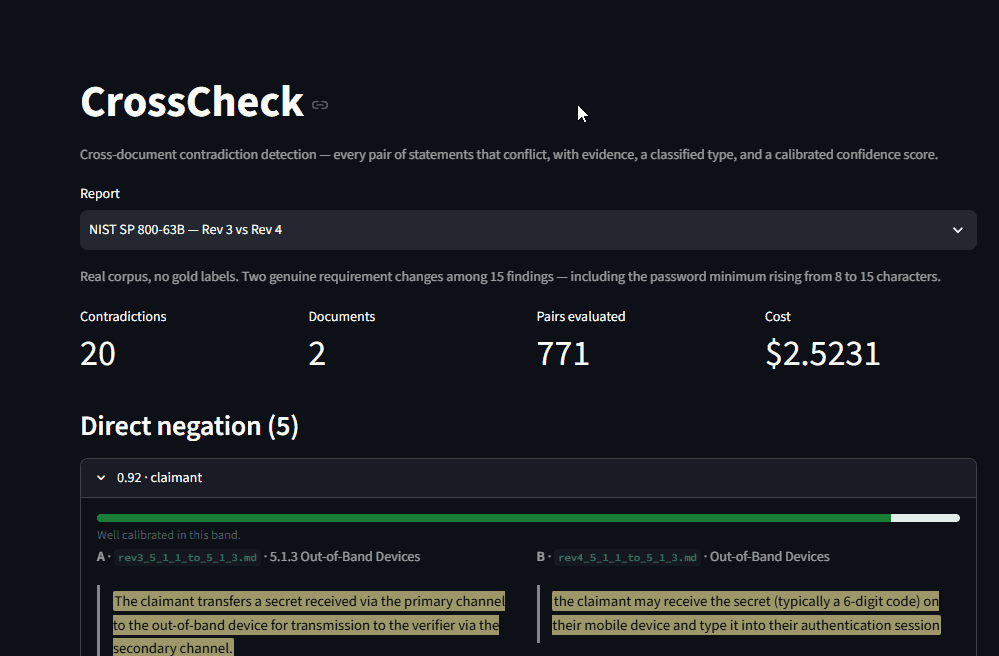
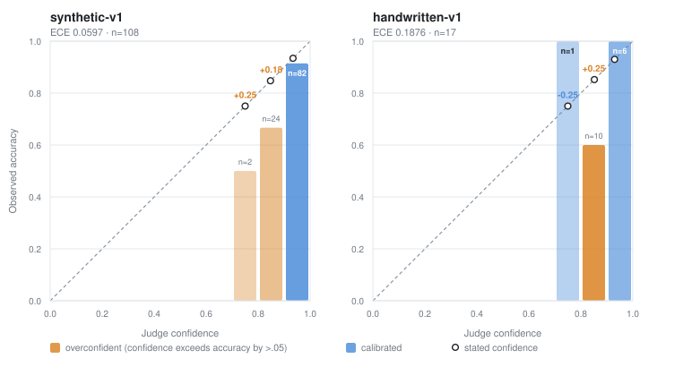

# CrossCheck

**Point it at a corpus and it tells you which statements contradict each other** — with evidence
quotes, source citations, a classified contradiction type, and a confidence score that has actually
been calibrated.

Enterprises accumulate overlapping documents: handbooks, contracts, specs, regulations. They drift
out of sync with themselves, and nobody notices, because finding the conflict requires already
suspecting it exists. "Chat with your PDFs" is reactive. CrossCheck is a proactive auditor: it reads
the whole corpus and reports every pair of statements that conflict.



## It found this in a published NIST standard

Run against **SP 800-63B Rev 3 vs Rev 4** — a real, public corpus nobody had labelled:

> **Rev 3** — "The claimant compares secrets received from the primary channel and the secondary
> channel and confirms the authentication via the secondary channel."
>
> **Rev 4** — "A third method of out-of-band authentication compares the secrets received from the
> primary and secondary channels and requests approval on the secondary channel. **This method is
> no longer considered acceptable** because it increases the likelihood that the subscriber would
> approve an authentication request without actually comparing the secrets as required."
>
> `obligation_reversal` · confidence 0.92

An implementer following Rev 3 is non-compliant with Rev 4. It also caught the password minimum
rising from **8 to 15 characters**. Two genuine contradictions out of 15 findings — and the honest
reading of that ratio is [below](#the-gap-between-synthetic-and-real).

## Quickstart

```bash
git clone https://github.com/kmeasabingias-a11y/crosscheck && cd crosscheck
cp .env.example .env          # add ANTHROPIC_API_KEY
docker compose up             # Qdrant + model warm-up + API + demo UI
```

Then open **http://localhost:8501**. First run downloads 4.2 GB of models into a named volume
(~4 minutes); every run after starts in about 20 seconds.

Or from the command line:

```bash
uv sync
crosscheck audit ./my-docs/ --report report.json --html report.html --max-cost 2.00
```

An audit costs roughly **$0.21 per 1,000 words** of corpus with a Haiku judge — measured across two
real runs, and printed before you spend it.

## Results

Two labelled benchmarks ship with the repo. Numbers are reproducible: `crosscheck eval --suite
benchmarks/suite.json` re-scores committed reports without re-running the pipeline.

| | Synthetic (139 pairs) | | | Hand-written (28 pairs) | | |
|---|---|---|---|---|---|---|
| **Type** | **P** | **R** | **F1** | **P** | **R** | **F1** |
| Direct negation | .733 | .733 | .733 | .571 | .571 | .571 |
| Numerical mismatch | .905 | .655 | .760 | 1.000 | .444 | .615 |
| Temporal conflict | 1.000 | .571 | .727 | .800 | 1.000 | .889 |
| Obligation reversal | .846 | .733 | .786 | 1.000 | .200 | .333 |
| Scope / jurisdiction | .895 | .586 | .708 | .000 | .000 | .000 |
| **Overall** | **.852** | **.662** | **.745** | **.765** | **.464** | **.578** |

Split by how lexically similar the two claims are — the check that exposes a system which only
catches near-duplicate phrasing:

| Stratum | Synthetic F1 | Hand-written F1 |
|---|---|---|
| High overlap (≥.30) | .823 | .667 |
| **Low overlap (<.30)** | **.667** | **.571** |

The synthetic set was generated by **GPT-4.1** and judged by **Claude**, deliberately different
model families, so the score is not measuring a model's ability to recognise its own output style.

Full report with confusion matrices, observability rates and per-stratum detail:
[`docs/eval-report.md`](docs/eval-report.md).

## Calibration

Almost no portfolio project checks whether its confidence scores mean anything. This one does.



The useful finding is not either panel but that **they agree**: the 0.80–0.90 band is overconfident
on both, by **+.181** and **+.252**, while ≥0.90 is close to honest. That replication makes it a
property of the judge rather than of one benchmark, so it transfers into a usable rule —
**trust ≥0.90, discount 0.80–0.90** — which the demo UI prints on every card.

Read the bins, not the scalar. The hand-written ECE of .1876 is computed over 17 samples and one of
its bins holds a single verdict; bar opacity in the plot tracks sample size for that reason.

## The gap between synthetic and real

This is the part most projects leave out, and the reason the evaluation exists.

| | F1 |
|---|---|
| Synthetic benchmark (injected) | **.745** |
| Hand-written set (realistic phrasing) | **.578** |
| Real corpus, NIST 800-63B | **~20% precision**, no recall claim |

Three honest statements about those numbers:

**The headline gap is .167, but the low-overlap gap is only .096.** Most of what separates the two
labelled benchmarks is *surface similarity*, not hand-authorship — the hand-written set's median
lexical overlap is 0.072 against the synthetic set's 0.310. Control for overlap and they nearly
agree. Recall carries the loss (−.198); precision mostly holds (−.087).

**On real text, precision drops hard.** Two genuine contradictions out of 15 findings on 800-63B.
Nine of the eleven false positives paired claims that simply were not about the same thing —
different actors, different quantities, complementary halves of one rule, a cross-reference
renumbering read as a numerical mismatch, and "20 bits of entropy" against "six decimal digits",
which is *the same value*. Scope discrimination, not judge reasoning, is the weakest link.

**No recall claim is made on the real corpus**, because there is no gold set — that is the point of
a real-corpus check. "20 findings" is not "20 of N".

An earlier real-corpus attempt on **SP 800-53** found nothing at all, and the reason turned out to
be the corpus rather than the system: a control catalogue states its requirements as
`[Assignment: organization-defined …]` placeholders, so it contained **zero concrete requirement
values** and four of the five contradiction types were unreachable before the pipeline started.
Both write-ups are in [`benchmarks/realcorpus/`](benchmarks/realcorpus/).

## How it works

Eight stages. The two that cost money are last, and they are last on purpose.

```
Parse → Chunk → Extract claims → Embed & store
      → Candidate pairs (hybrid BM25 + dense)
      → Rerank (cross-encoder) → NLI filter → LLM judge → Report
```

On the 800-63B run: 283 claims → 4,809 candidate pairs → 2,830 reranked → **771 past NLI** → 20
verdicts. Judging all 4,809 would have cost about $13; judging 771 cost **$2.52**. NLI is ~1000×
cheaper than an LLM call, which is what makes the whole thing affordable.

Every LLM call passes through one wrapper that tracks spend against a ceiling; when it is reached
the audit stops dispatching, finalises what it has, and marks the report `partial`. Claim
extractions and verdicts are cached by content hash, so an interrupted audit resumes instead of
re-paying.

Details, diagrams and the known gaps: [`docs/architecture.md`](docs/architecture.md).

## Contradiction types

| Type | Example |
|---|---|
| `DIRECT_NEGATION` | "All employees receive 20 PTO days" vs "Employees are not entitled to PTO" |
| `NUMERICAL_MISMATCH` | "Refunds within 30 days" vs "Refunds within 60 days" |
| `TEMPORAL_CONFLICT` | v3.1 deprecates a treatment v2.8 still recommends, both still in the corpus |
| `OBLIGATION_REVERSAL` | "Vendors must carry insurance" vs "Vendors are not required to" |
| `SCOPE_JURISDICTION` | "All contracts under Delaware law" vs "EU vendor contracts under Irish law" |

`CONDITIONAL_TRIPLET` — three documents whose conditions overlap with incompatible conclusions — is
**roadmap, not shipped**. It is the hardest type and where off-the-shelf NLI performs worst;
shipping it half-working would produce unconvincing numbers. The enum value is reserved.

## Stack

Python 3.11 · uv · Pydantic v2 · Typer · FastAPI · Streamlit · Qdrant ·
`bge-large-en-v1.5` (dense) + BM25 (sparse) · `bge-reranker-v2-m3` · `nli-deberta-v3-base` ·
Claude (judge, extraction) · GPT-4.1 (benchmark generation) · Docker Compose · ruff · mypy --strict

No LangChain, deliberately — each stage has batching, caching, cost-capping and resume requirements
that are clearer as plain Python, and the orchestration is the engineering rather than something to
hide.

## Project layout

```
src/crosscheck/     pipeline, service, UI logic     tests/         410 tests
benchmarks/         synthetic · handwritten · realcorpus · results
docs/               architecture · eval-report · calibration
scripts/            corpus slicing, plot generation
DECISIONS.md        51 engineering decisions, with the rejected options
```

## Development

```bash
uv sync                      # + --extra ui for the demo
docker compose up -d qdrant  # the CLI and tests run on the host
uv run pytest                # 410 tests; integration tests need an API key
uv run ruff check . && uv run ruff format --check . && uv run mypy
```

`DECISIONS.md` records every non-obvious choice with the options considered and what was given up —
including the ones that were wrong and got reversed.

## Licence

MIT — see [`LICENSE`](LICENSE).
