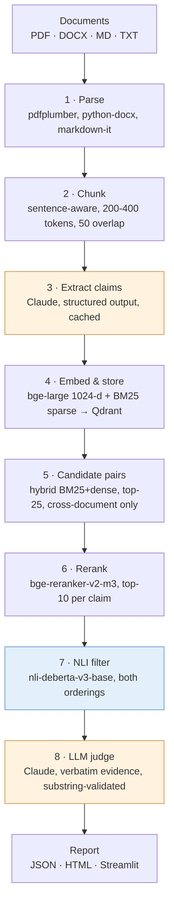
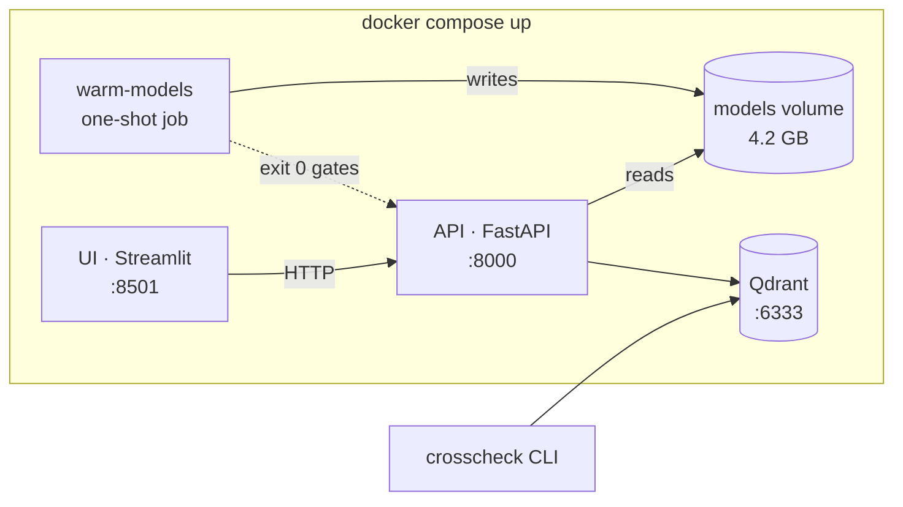

# Architecture

CrossCheck is an eight-stage pipeline with a service layer and a demo on top. Each stage has a
defined input schema, a defined output schema, and an interface that can be swapped for
evaluation. Stages run in sequence; fan-out and batching happen inside stages, not between them.

## The pipeline



The two shaded stages are the ones that cost money. Everything else runs locally.

## Why two-stage verification

This is the load-bearing decision in the whole design.

A 283-claim corpus — the NIST SP 800-63B run — produced **4,809 candidate pairs**. Sending all of
them to an LLM judge at roughly $0.0027 per pair would cost about $13 and take hours. Instead:

| stage | pairs in | pairs out | cost |
|---|---|---|---|
| Candidate generation | 283 claims | 4,809 | free |
| Rerank | 4,809 | 2,830 | free, ~6 min CPU |
| NLI filter | 2,830 | **771** | free |
| LLM judge | 771 | 20 verdicts | **$2.52** |

NLI is roughly 1000× cheaper than an LLM call and runs on the same CPU that is already loaded for
embedding. It reduces the judge's workload by 73% here, and the judge does the careful reasoning
only on what survives. This is the pattern from Gokul et al. 2025 and ContraGen, and it is the
reason an audit costs dollars rather than tens of dollars.

**Recall is the priority in the filter, precision in the judge.** A pair is kept if contradiction
is the NLI model's top label *or* its contradiction probability clears a threshold. Both orderings
of the pair are scored, because NLI is directional and contradiction detection should not depend
on which claim is treated as the premise.

## Cost is bounded, and audits resume

Every LLM call goes through one wrapper that tracks spend against a ceiling. When the ceiling is
reached the orchestrator stops dispatching new judge calls, finalizes the report with what it has,
and marks it `partial: true` with the reason. A runaway corpus never silently racks up spend.

The ceiling is a **stop-dispatching bound, not a hard cap** — it is checked *before* a call, so a
total can overshoot by at most one call's cost. Measured: a $0.02 ceiling finished at $0.0350.

Claim extractions and judge verdicts are both cached on disk, keyed by content hash, so an audit
that dies at document 90 of 100 resumes rather than restarting. The verdict cache folds in the
judge model; the extraction cache does not, which is a known gap.

## Service and demo topology



Three things in that picture are deliberate:

- **`warm-models` gates the API.** The four local models total 4.2 GB and load lazily, which would
  otherwise put the download inside the first audit request where nobody can see it. The one-shot
  job downloads them into a named volume and the API waits on its exit code.
- **The models live in a volume, not the image.** A layer is rebuilt on every machine and destroyed
  by `--no-cache`; a volume survives both. The image is 2.71 GB rather than ~6 GB.
- **The UI is an HTTP client of the API**, not a second entry point into the pipeline. It loads no
  models and starts instantly, and the API's rules — reset the claim store per audit, one audit at
  a time — apply to it rather than being bypassed.

## Module map

```
src/crosscheck/
├── config.py              Typed settings, incl. the cost ceiling
├── models.py              Document, Claim, Pair, Verdict
├── llm.py                 The one LLM wrapper: retries, cost tracking, ceiling
├── prompts/               Versioned prompt files — never inlined in Python
├── ingestion/             parsers · chunking · claim_extractor
├── storage/               qdrant_client · claim_repo · embeddings
├── retrieval/             candidate_gen (hybrid) · reranker
├── detection/             taxonomy · nli_filter · llm_judge
├── aggregation/           report · html_renderer
├── evaluation/            synthetic_gen · metrics · runner · gold
├── orchestrator.py        audit(): cost ceiling, resume, stage sequencing
├── api/                   FastAPI service
├── ui/                    client · presenter (no Streamlit imports)
└── warmup.py              Model pre-load for the container
```

## Why not LangChain

Each stage has specific control-flow requirements — batching, caching, reranking, cost-capping,
resume — that are clearer as plain Python. A framework would obscure exactly the engineering an
interviewer wants to probe, make debugging harder, and enlarge the dependency surface. The
orchestration *is* the engineering; hiding it would defeat the point.

## Known architectural gaps

These are deliberate and recorded in `DECISIONS.md`, not oversights:

- **Retrieval is not scoped by corpus** — the only cross-document filter is `doc_id != self`. The
  API works around it by resetting the claim store on every audit (D47); the real fix needs a
  corpus field on the claim payload.
- **The extraction cache does not fold in the extraction model**, so switching models silently
  reuses the previous model's claims.
- **No per-document latency instrumentation**, so §9.2's P50/P95 figures are not reported rather
  than being reported as zero.
- **Scope discrimination is the weakest link.** On the real corpus, nine of eleven false positives
  paired claims that were not about the same thing — different actors, different quantities,
  complementary halves of one rule. That is a retrieval-and-judging precision problem and it is
  the most valuable thing left to attack.

## References

- Gokul, Tenneti, Nakkiran (2025). *Contradiction Detection in RAG Systems.* arXiv:2504.00180 —
  motivates the two-stage NLI→LLM architecture.
- Mantravadi et al. (2025). *LegalWiz.* arXiv:2510.03418 — taxonomy and synthetic benchmark method.
- Li, Raheja, Kumar (2023). *ContraDoc.* arXiv:2311.09182.
- Koreeda, Manning (2021). *ContractNLI.* arXiv:2110.01799.
